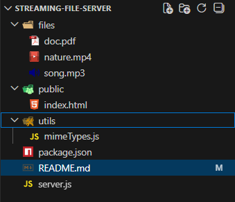

# Node.js Streaming File Server

- A lightweight streaming server built with pure Node.js that supports:
- Video, audio, and PDF streaming
- HTTP Range requests (seek, pause, resume)
- Memory-efficient file streaming
- No frameworks (no Express)
  This project demonstrates low-level Node.js, streams, and HTTP protocol mastery.

## Features

- Streams large files without loading them into memory
- Supports partial content (206 Partial Content)
- Works with <video>, <audio>, and <iframe>
- Secure file access (restricted to /files folder)
- MIME type detection
- Clean demo UI

## Project Structure

## Setup & Run

1. Install Node.js
2. Clone or create project
  npm install
  npm start
3. Server runs at: 
  http://localhost:3000

## How Streaming works

- Browser sends Range header automatically
- Server:
  - Parses byte range
  - Streams only requested chunk
  - Respnds with 206 Partial content
- Enables:
  - Seeking
  - Resume
  - Efficient memory usage

## Supported Types

- video/mp4
- audio/mp3
- application/pdf

## Security Rules

- Files must be inside /files
- Path travesal blocked ../
- Only allowed extensions accepted
- Invalid requests return:
  - 400(bad request)
  - 403(forbidden)
  - 404(not found)
  - 416(invalid range)

## What this project demonstrates

- Node.js streams
- Backpressure handling
- HTTP headers & status codes
- Range request implementation
- Memory-efficient design
- Low-level server architecture

